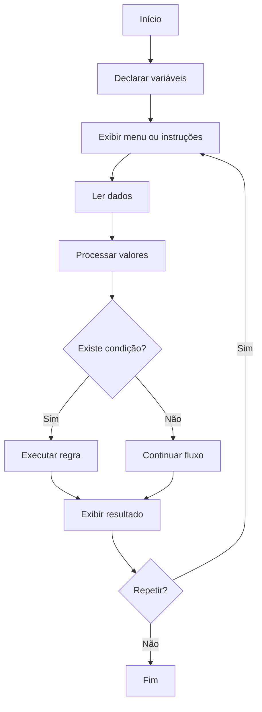

<div align="center">

# 💻 Desafios e Atividades em C

Repositório de estudos com exercícios, desafios, jogos e pequenos sistemas desenvolvidos durante o aprendizado de lógica de programação e linguagem C.


</div>

---

## 📌 Sobre o repositório

Este repositório reúne exercícios, atividades acadêmicas, desafios de lógica e pequenos projetos desenvolvidos principalmente em linguagem C.

Os códigos representam diferentes etapas do aprendizado, desde programas introdutórios até atividades com:

* estruturas condicionais;
* laços de repetição;
* menus interativos;
* números aleatórios;
* vetores;
* matrizes;
* strings;
* estruturas compostas;
* cálculos;
* jogos de terminal.

O objetivo é registrar a evolução prática na linguagem e manter uma base de consulta para estudos futuros.

> Os arquivos possuem caráter educacional e podem conter abordagens iniciais que serão refatoradas conforme a evolução técnica.

---

## 🎯 Objetivos

Os principais objetivos deste repositório são:

* praticar a sintaxe da linguagem C;
* desenvolver lógica de programação;
* compreender entrada e saída de dados;
* utilizar operadores;
* trabalhar com condicionais;
* utilizar estruturas de repetição;
* criar menus interativos;
* manipular strings;
* trabalhar com vetores e matrizes;
* utilizar números aleatórios;
* criar pequenos jogos;
* resolver atividades acadêmicas;
* registrar a evolução nos estudos.

---

## 🧠 Conteúdos praticados

### Fundamentos

* função `main`;
* bibliotecas;
* variáveis;
* constantes;
* tipos de dados;
* operadores;
* entrada com `scanf`;
* saída com `printf`.

### Estruturas condicionais

* `if`;
* `else`;
* `else if`;
* `switch`;
* operador lógico;
* comparação de valores.

### Estruturas de repetição

* `for`;
* `while`;
* `do while`;
* contadores;
* acumuladores;
* condições de parada.

### Estruturas de dados

* vetores;
* matrizes;
* strings;
* variáveis compostas;
* armazenamento de dados relacionados.

### Outros conceitos

* números pseudoaleatórios;
* menus;
* validações;
* cálculos matemáticos;
* divisão por zero;
* comparação de atributos;
* organização de fluxo.

---

## 🧩 Principais atividades

### 🎯 Jogo de adivinhação

Arquivo:

```text
Adivinhacao.c
```

O computador gera um número aleatório entre 0 e 10 e o jogador possui três tentativas para acertar.

A cada erro, o programa informa se o número correto é maior ou menor que o palpite.

Conceitos praticados:

* `rand`;
* `srand`;
* `time`;
* laço `for`;
* condicionais;
* flags;
* menu com `switch`;
* repetição com `do while`.

---

### ✊ Pedra, Papel e Tesoura

Arquivo:

```text
PedraPapelTesoura.c
```

Atividade voltada à criação do jogo clássico Pedra, Papel e Tesoura.

Conceitos esperados no exercício:

* escolha do usuário;
* escolha do computador;
* números aleatórios;
* comparação de possibilidades;
* definição do vencedor.

---

### ♟️ Movimentação de peças de xadrez

Arquivo:

```text
Xadrez.c
```

Atividade relacionada à representação de movimentos de peças de xadrez por meio de estruturas de repetição.

Conceitos praticados:

* loops;
* controle de quantidade de movimentos;
* organização de saída;
* lógica sequencial.

---

### 🃏 Super Trunfo de cidades

Arquivo:

```text
supertrunfo.c
```

Projeto de terminal que permite cadastrar duas cartas representando cidades.

Cada carta possui dados como:

* estado;
* código;
* cidade;
* população;
* área;
* PIB;
* quantidade de pontos turísticos;
* densidade demográfica;
* PIB per capita.

O programa possui um menu para:

1. cadastrar a primeira carta;
2. cadastrar a segunda carta;
3. visualizar as cartas;
4. comparar atributos;
5. consultar as regras;
6. sair.

---

## 📊 Atributos do Super Trunfo

| Atributo          | Tipo      |
| ----------------- | --------- |
| Estado            | Caractere |
| Código            | String    |
| Cidade            | String    |
| População         | Inteiro   |
| Área              | Real      |
| PIB               | Real      |
| Pontos turísticos | Inteiro   |
| Densidade         | Calculado |
| PIB per capita    | Calculado |

---

## 🧮 Cálculos utilizados

### Densidade demográfica

```text
densidade = população ÷ área
```

Antes da divisão, o programa verifica se a área é diferente de zero.

### PIB per capita

```text
PIB per capita = PIB total ÷ população
```

O código também verifica se a população é diferente de zero.

---

## 🏦 Sistema simples de saque e depósito

Arquivo:

```text
Sistema_Simples_Saque_Deposito.c
```

Programa de terminal com um menu bancário básico.

As opções disponíveis são:

* consultar saldo;
* fazer depósito;
* fazer saque;
* sair.

O sistema inicia com um saldo de exemplo e atualiza o valor após depósitos e saques.

Conceitos praticados:

* `while`;
* `switch`;
* atualização de saldo;
* validação de saldo insuficiente;
* entrada de dados;
* menu interativo.

---

## 🔢 Exercícios com matrizes

O repositório possui diferentes arquivos relacionados a matrizes:

```text
Aula11_Matrizes_Ex1.c
Aula11_Matrizes_Ex2.c
Aula11_Matrizes_Atv1a.c
Aula11_Matrizes_Atv1b.c
Aula11_Matrizes_Atv1c.c
Aula11_Matrizes_Desafio.c
```

Essas atividades trabalham conceitos como:

* declaração de matrizes;
* acesso por linha e coluna;
* preenchimento;
* leitura;
* impressão;
* percursos com laços aninhados;
* cálculos sobre posições.

---

## 🧱 Fluxo típico dos programas



---

## 🛠️ Tecnologias e ferramentas

| Tecnologia | Aplicação                             |
| ---------- | ------------------------------------- |
| C          | Linguagem principal                   |
| GCC        | Compilação                            |
| Git        | Controle de versão                    |
| GitHub     | Hospedagem dos códigos                |
| CLion      | Desenvolvimento de parte dos arquivos |
| VS Code    | Edição e execução alternativa         |

O repositório também possui ao menos um arquivo com extensão `.cpp`. Portanto, existe conteúdo que pode estar utilizando C++ ou apenas ter sido salvo com a extensão incorreta.

---

## 📁 Organização do repositório

Os exercícios estão organizados por assunto para facilitar a navegação e acompanhar a evolução dos estudos.

```text
Desafios-e-Atividades-em-C/
│
├── 01-fundamentos/
│   ├── Desafio1_de_365.c
│   └── Exemplo_aula4.cpp
│
├── 02-condicionais/
│   ├── Desafio4_de_365.cpp
│   ├── desafio1Leo.c
│   └── questao9.c
│
├── 03-repeticao/
│   ├── Desafio2_de_365.c
│   ├── Questao5.c
│   └── questão_10.cpp
│
├── 04-vetores/
│   └── Aula12_Var_Compostas.c
│
├── 05-matrizes/
│   ├── Aula11_Matrizes_Atv1a.c
│   ├── Aula11_Matrizes_Atv1b.c
│   ├── Aula11_Matrizes_Atv1c.c
│   ├── Aula11_Matrizes_Desafio.c
│   ├── Aula11_Matrizes_Ex1.c
│   └── Aula11_Matrizes_Ex2.c
│
├── 06-jogos/
│   ├── Adivinhacao.c
│   ├── PedraPapelTesoura.c
│   ├── Xadrez.c
│   └── supertrunfo.c
│
├── 07-sistemas/
│   └── Sistema_Simples_Saque_Deposito.c
│
├── 08-avaliacoes/
│   └── Desafio_Final_FSF.c
│
├── .gitignore
└── README.md
```

### Categorias

| Diretório         | Conteúdo                                   |
| ----------------- | ------------------------------------------ |
| `01-fundamentos`  | Sintaxe, variáveis, entrada e saída        |
| `02-condicionais` | Exercícios com `if`, `else` e `switch`     |
| `03-repeticao`    | Atividades com `for`, `while` e `do while` |
| `04-vetores`      | Exercícios com arrays unidimensionais      |
| `05-matrizes`     | Matrizes e laços aninhados                 |
| `06-jogos`        | Jogos desenvolvidos no terminal            |
| `07-sistemas`     | Pequenos sistemas interativos              |
| `08-avaliacoes`   | Atividades avaliativas                     |

---

## 🚀 Como compilar e executar

### Pré-requisitos

É necessário possuir:

* Git;
* compilador GCC;
* terminal.

Verifique o compilador:

```bash
gcc --version
```

### Clone o repositório

```bash
git clone https://github.com/ONestoDev/Desafios-e-Atividades-em-C.git
```

Acesse a pasta:

```bash
cd Desafios-e-Atividades-em-C
```

### Compile um exercício

Jogo de adivinhação:

```bash
gcc -Wall -Wextra -pedantic \
    06-jogos/Adivinhacao.c \
    -o adivinhacao
```

Super Trunfo:

```bash
gcc -Wall -Wextra -pedantic \
    06-jogos/supertrunfo.c \
    -o supertrunfo
```

Sistema bancário:

```bash
gcc -Wall -Wextra -pedantic \
    07-sistemas/Sistema_Simples_Saque_Deposito.c \
    -o sistema-bancario
```

### Execute no Linux ou macOS

```bash
./adivinhacao
```

### Execute no Windows

```bash
adivinhacao.exe
```

> Cada arquivo possui sua própria função `main` e deve ser compilado separadamente.

## ▶️ Executando o Super Trunfo

Compile:

```bash
gcc supertrunfo.c -o supertrunfo
```

Execute:

```bash
./supertrunfo
```

No Windows:

```bash
supertrunfo.exe
```

---

## 🧪 Exemplo do jogo de adivinhação

```text
*** Menu de Opções ***

1. Iniciar Jogo
2. Verificar Regras
3. Sair
```

Durante a partida:

```text
Eu pensei em um número de 0 a 10.
Você tem 3 tentativas para adivinhar!

Digite o seu palpite: 4
Errou... O número que pensei é MAIOR que 4.
```

---

## 🧪 Exemplo do sistema bancário

```text
*** Menu de Opções ***

1. Verificar Saldo
2. Fazer Depósito
3. Fazer Saque
4. Sair
```

Exemplo:

```text
Digite o valor do saque: 200
Saque realizado com sucesso.
```

---

## ✅ Pontos fortes

O repositório demonstra prática com:

* programas de terminal;
* menus;
* jogos;
* cálculos;
* estruturas de repetição;
* condicionais;
* strings;
* matrizes;
* entrada de dados;
* pequenos sistemas;
* resolução de problemas.

O Super Trunfo é atualmente um dos arquivos mais completos, por combinar cadastro, cálculos, menus, comparações e validações.

---

## ⚠️ Limitações atuais

O repositório apresenta alguns pontos que podem ser melhorados:

* arquivos sem organização por assunto;
* nomes inconsistentes;
* arquivos da IDE versionados;
* ausência de `.gitignore` adequado;
* mensagens com pequenos erros de escrita;
* funções muito longas;
* lógica concentrada em `main`;
* pouca validação de entrada;
* dependência de `system("cls")`;
* uso de tipos inadequados em alguns campos;
* ausência de testes automatizados;
* ausência de instruções individuais para cada atividade.

---

## 🗺️ Melhorias futuras

Entre as melhorias recomendadas estão:

* organizar os exercícios em pastas;
* padronizar nomes dos arquivos;
* adicionar `.gitignore`;
* remover arquivos internos da IDE;
* separar programas em funções;
* criar arquivos de cabeçalho;
* validar entradas do usuário;
* evitar `system("cls")`;
* adicionar exemplos de execução;
* documentar cada atividade;
* criar um índice de exercícios;
* adicionar Makefile;
* compilar com avisos habilitados;
* revisar código com `-Wall` e `-Wextra`.

---

## ⚙️ Compilação com avisos

Utilize:

```bash
gcc -Wall -Wextra -pedantic arquivo.c -o programa
```

Exemplo:

```bash
gcc -Wall -Wextra -pedantic supertrunfo.c -o supertrunfo
```

Essas opções ajudam a identificar:

* variáveis não utilizadas;
* conversões perigosas;
* incompatibilidades de tipos;
* problemas de declaração;
* construções não portáveis.

---

## 📚 Aprendizados desenvolvidos

Durante os exercícios foram praticados:

* pensamento computacional;
* algoritmos;
* sintaxe da linguagem C;
* bibliotecas;
* variáveis;
* tipos;
* operadores;
* condicionais;
* laços;
* menus;
* vetores;
* matrizes;
* strings;
* números aleatórios;
* validações;
* modularização inicial;
* jogos de terminal.

---

## 🎓 Contexto educacional

Os códigos foram desenvolvidos durante disciplinas acadêmicas, cursos e atividades relacionadas a:

* Introdução à Programação;
* Algoritmos e Programação;
* Pensamento Computacional;
* Fundamentos de Programação.

O repositório representa a evolução prática nos estudos iniciais de desenvolvimento de software.

---

## 👨‍💻 Autor

Desenvolvido por **Ernesto — ONestoDev**.

[](https://github.com/ONestoDev)

---

## 📄 Licença

Este repositório possui finalidade educacional.

Para definir claramente as condições de uso e distribuição, adicione um arquivo `LICENSE`.
